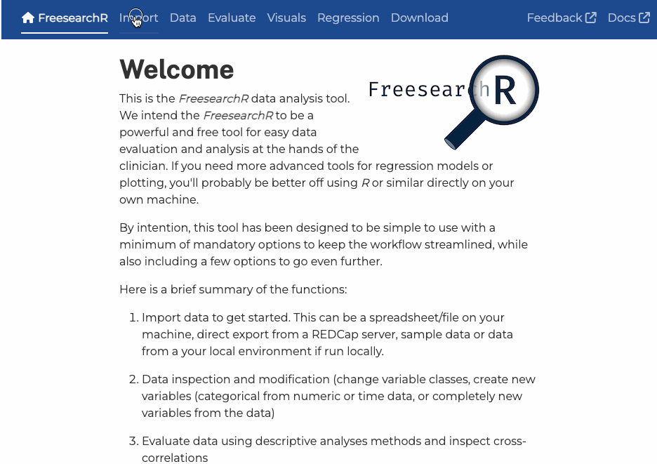

# FreesearchR

The [***FreesearchR***](https://app.freesearchr.org) is a simple,
clinical health data exploration and analysis tool to democratise
clinical research by assisting any researcher to easily evaluate and
analyse data and export publication ready results.

[***FreesearchR***](https://app.freesearchr.org) is free and
open-source, and is [accessible in your web browser through this
link](https://app.freesearchr.org). The app can also run locally, please
[see below](#run-locally-on-your-own-machine-sec-run-locally).

All feedback is welcome and can be shared as a GitHub issue. Any
suggestions on collaboration is much welcomed. Please reach out!



FreesearchR demo

## Motivation

This app has the following simple goals:

1.  help the health clinician getting an overview of data in quality
    improvement projects and clinical research

2.  help learners get a good start analysing data and coding in *R*

3.  ease quick data overview and basic visualisations for any clinical
    researcher

Here’s a polished and restructured version of your README section for
clarity, conciseness, and user-friendliness:

## Run Locally on Your Own Machine

The **FreesearchR** app can be run locally on your machine, ensuring no
data is transmitted externally. Below are the available options for
setup and configuration.

### Configuration & Data Loading

The app can be configured either by passing a named list to `run_app()`
or by setting environment variables in a **Docker Compose** file. The
following variables control data access and display behavior. If no
values are provided, the app will use the defaults listed below.

**Configuration Variables**

| Variable             | Description                                                             | Default   |
|----------------------|-------------------------------------------------------------------------|-----------|
| `INCLUDE_GLOBALENV`  | Load datasets already present in the global R environment into the app  | `FALSE`   |
| `DATA_LIMIT_DEFAULT` | Default number of observations for previewing or working with a dataset | `10,000`  |
| `DATA_LIMIT_UPPER`   | Maximum number of observations a user can set for the upper limit       | `100,000` |
| `DATA_LIMIT_LOWER`   | Minimum number of observations a user can set for the lower limit       | `1`       |

### Run from R (or RStudio)

If you’re working with data in R, **FreesearchR** is a quick and easy
tool for exploratory analysis.

1.  **Requirement:** Ensure you have [R](https://www.r-project.org/)
    installed, and optionally an editor like
    [RStudio](https://posit.co/download/rstudio-desktop/).

2.  Open the **R console** and run the following code to install the
    [FreesearchR](https://github.com/agdamsbo/FreesearchR) package and
    launch the app:

    ``` r
    if (!require("devtools")) install.packages("devtools")
    devtools::install_github("agdamsbo/FreesearchR")
    library(FreesearchR)
    # Load sample data (e.g., mtcars) to make it available in the app
    data(mtcars)
    launch_FreesearchR(INCLUDE_GLOBALENV=TRUE)
    ```

All the variables specified above can also be passed to the app on
launch from R.

### Running with Docker Compose

For advanced users, you can deploy **FreesearchR** using Docker. A data
folder can be mounted to `/app/data` to automatically load supported
file types (`.csv`, `.tsv`, `.txt`, `.xls`, `.xlsx`, `.ods`, `.dta`,
`.rds`) at startup.

To mount a local data folder, add a `volumes` entry to your
`docker-compose.yml` file:

``` yaml
services:
  shiny:
    image: ghcr.io/agdamsbo/freesearchr:latest
    volumes:
      - ./data:/app/data:ro
    environment:
      - INCLUDE_GLOBALENV=FALSE
      - DATA_LIMIT_DEFAULT=10000
      - DATA_LIMIT_UPPER=100000
      - DATA_LIMIT_LOWER=1
    ports:
      - '3838:3838'
    restart: on-failure
```

- The `:ro` flag mounts the folder as **read-only**, preventing the app
  from modifying your original data files.

- If no volume is mounted, the app will start without any preloaded
  datasets.

## Code of Conduct

Please note that the ***FreesearchR*** project is published with a
[Contributor Code of
Conduct](https://contributor-covenant.org/version/2/1/CODE_OF_CONDUCT.html).
By contributing to this project, you agree to abide by its terms.

## Translators

Thank you very much to all translators having helped to translate and
validate translation drafts.

## Acknowledgements

Like any other project, this project was never possible without the
great work of others. These are some of the sources and packages I have
used:

- The ***FreesearchR*** app is built with
  [Shiny](https://shiny.posit.co/) and based on
  [*R*](https://www.r-project.org/).

- [gtsummary](https://www.danieldsjoberg.com/gtsummary/): superb and
  flexible way to create publication-ready analytical and summary
  tables.

- [dreamRs](https://github.com/dreamRs): maintainers of a broad
  selection of great extensions and tools for
  [Shiny](https://shiny.posit.co/).

- [easystats](https://easystats.github.io/easystats/): the
  [`performance::check_model()`](https://easystats.github.io/performance/articles/check_model.html)
  function was central in sparking the idea to create a data analysis
  tool.

- [IDEAfilter](https://biogen-inc.github.io/IDEAFilter/): a visually
  appealing data filter function based on the
  [{shinyDataFilter}](https://github.com/dgkf/shinyDataFilter).

This project was all written by a human and not by any AI-based tools.

The online ***FreesearchR*** app contains a tracking script,
transmitting minimal data on usage. No uploaded data is transmitted
anywhere. Have a look at the [tracking data
here](https://analytics.gdamsbo.dk/share/2i4BNpMcDMB9lJvF/agdamsbo.shinyapps.io).
No tracking data is sent running the app locally (see above).
